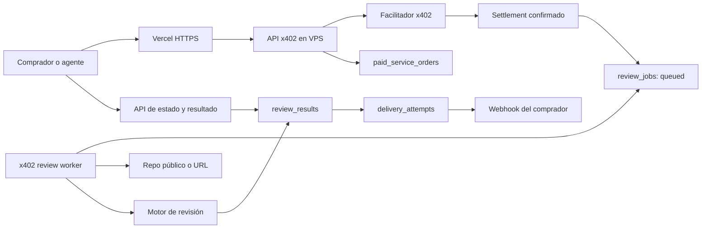

# Plan de revisión automática y entrega x402

Estado: implementado y desplegado; pendiente únicamente el pago real controlado
Última verificación operativa: 2026-08-05
Repositorio: `x402-wallet-readiness-service`
Alcance inicial: `Quick Review` e `Integration Triage`

## 1. Objetivo

Convertir los pedidos x402 pagados en revisiones ejecutadas y entregadas sin
intervención manual:

1. El comprador envía `repository_or_url`, `goal` y datos opcionales de
   entrega.
2. x402 verifica y liquida el pago.
3. El pedido se coloca en una cola durable.
4. Un worker aislado realiza la revisión.
5. El resultado se valida, guarda en JSON y renderiza en Markdown.
6. El comprador consulta el resultado o recibe una notificación webhook.

La recepción de un pago nunca debe depender de que el worker esté disponible.
Una caída o reinicio debe retrasar el trabajo, no perderlo ni duplicarlo.

## 2. Estado actual

Ya existe:

- Recepción x402 para Quick Review e Integration Triage mediante GET y POST.
- Validación de `repository_or_url`, `goal`, `contact` y `constraints`.
- Persistencia del pedido antes del settlement.
- Registro posterior del transaction hash, payer y estado del settlement.
- Deduplificación mediante fingerprint SHA-256 de la autorización de pago.
- PostgreSQL privado en el VPS y backups diarios.
- Vercel como proxy HTTPS hacia el servicio Node del VPS.

Implementado en el MVP desplegado:

- Cola durable PostgreSQL con leases, reintentos y recuperación.
- Worker automático aislado mediante systemd, con concurrencia `1`.
- Inspección de repositorios GitHub públicos y endpoints HTTPS con límites y
  defensa SSRF.
- Resultado canónico validado, persistido en JSON y renderizado en Markdown.
- API autenticada de estado, resultado y reporte.
- Webhooks firmados, idempotentes y con reintentos.
- Métricas, alertas, backup y runbook operativo en el VPS.

Pendiente fuera de la automatización verificable desde este entorno:

- Firmar un pago x402 real con una wallet pagadora controlada y completar el
  flujo end-to-end en producción.

## 3. Decisiones para el MVP

- Mantener Vercel únicamente como entrada HTTPS. La base de datos y el worker
  continúan en el VPS.
- Usar PostgreSQL como cola con leases y `FOR UPDATE SKIP LOCKED`; no añadir
  Redis ni otro servicio en el MVP.
- Ejecutar el worker como `x402-review-worker.service`, separado de la API.
- Procesar solo repositorios públicos de GitHub y URLs HTTPS públicas.
- No ejecutar scripts de un repositorio sin un sandbox desechable.
- No hacer commits, despliegues, pagos ni escrituras externas durante una
  revisión.
- Entregar JSON canónico y Markdown generado determinísticamente desde el JSON.
- Usar polling autenticado como entrega garantizada y webhook como entrega
  opcional.
- Mantener los SLA publicados de 12h y 24h durante el rollout, aunque el
  objetivo operativo sea completar Quick Review en menos de 15 minutos e
  Integration Triage en menos de 30 minutos.

## 4. Arquitectura objetivo



## 5. Modelo de datos

Conservar `paid_service_orders` como registro financiero y de intake. Separar
la ejecución y entrega para no mezclar el estado del pago con el del trabajo.

Agregar de forma aditiva a `paid_service_orders`:

- `callback_url TEXT`
- `response_format TEXT NOT NULL DEFAULT 'both'`
- `language TEXT NOT NULL DEFAULT 'en'`
- `access_token_hash TEXT UNIQUE`

### `review_jobs`

- `job_id UUID PRIMARY KEY`
- `order_id TEXT UNIQUE REFERENCES paid_service_orders(order_id)`
- `service TEXT NOT NULL`
- `status TEXT NOT NULL`
- `attempt_count INTEGER NOT NULL DEFAULT 0`
- `max_attempts INTEGER NOT NULL DEFAULT 3`
- `priority INTEGER NOT NULL DEFAULT 100`
- `available_at TIMESTAMPTZ NOT NULL DEFAULT NOW()`
- `lease_owner TEXT`
- `lease_expires_at TIMESTAMPTZ`
- `started_at TIMESTAMPTZ`
- `completed_at TIMESTAMPTZ`
- `last_error TEXT`
- `created_at` y `updated_at`

Estados permitidos:

- `awaiting_settlement`
- `queued`
- `processing`
- `needs_input`
- `completed`
- `failed`
- `cancelled`

### `review_results`

- `result_id UUID PRIMARY KEY`
- `order_id TEXT UNIQUE REFERENCES paid_service_orders(order_id)`
- `schema_version TEXT NOT NULL`
- `verdict TEXT NOT NULL`
- `score INTEGER`
- `result_json JSONB NOT NULL`
- `report_markdown TEXT NOT NULL`
- `target_snapshot JSONB NOT NULL`
- `agent_metadata JSONB NOT NULL`
- `created_at` y `updated_at`

`target_snapshot` debe registrar la evidencia reproducible disponible, por
ejemplo commit SHA, URL final después de redirects y tiempos de las probes.

### `delivery_attempts`

- `delivery_id UUID PRIMARY KEY`
- `order_id TEXT REFERENCES paid_service_orders(order_id)`
- `channel TEXT NOT NULL`
- `destination TEXT NOT NULL`
- `event_id TEXT NOT NULL UNIQUE`
- `status TEXT NOT NULL`
- `attempt_count INTEGER NOT NULL DEFAULT 0`
- `next_attempt_at TIMESTAMPTZ`
- `last_http_status INTEGER`
- `last_error TEXT`
- `delivered_at TIMESTAMPTZ`
- `created_at` y `updated_at`

### Acceso al resultado

- Generar un token aleatorio por pedido.
- Devolverlo solamente en el receipt pagado.
- Guardar únicamente su hash SHA-256.
- Persistir una versión saneada del receipt que no contenga el token en claro.
- Exigir `Authorization: Bearer <token>` para estado y resultado.
- Nunca aceptar el token en query params para evitar filtración en logs.

## 6. Transiciones de estado

1. Antes del settlement, crear el job como `awaiting_settlement` junto al
   pedido y al hash del token de acceso.
2. En `onAfterSettle`, registrar el pago y cambiar el job a `queued` dentro de
   una misma transacción.
3. En `onSettleFailure`, cambiar el job a `cancelled`.
4. El worker reclama un job `queued`, incrementa intentos y crea un lease.
5. El worker renueva el lease mientras trabaja.
6. Un resultado válido cambia el job a `completed` y crea la entrega.
7. Una falta de acceso o información cambia el job a `needs_input`.
8. Un fallo temporal vuelve a `queued` con backoff.
9. Un fallo definitivo o intentos agotados cambia el job a `failed` y genera
   una notificación de error.
10. Un proceso de recuperación devuelve a `queued` cualquier job `processing`
    cuyo lease haya expirado.

La semántica será procesamiento al menos una vez con escrituras idempotentes.
`order_id` será la clave de idempotencia para impedir dos revisiones finales.

## 7. Cambios al intake

Mantener los campos existentes y agregar campos estructurados opcionales:

- `callback_url`: URL HTTPS para la notificación.
- `response_format`: `json`, `markdown` o `both`; default `both`.
- `language`: idioma del informe; default `en`.

`contact` continuará como referencia humana. No se intentará enviar correo a
partir de un texto libre. El correo será una fase posterior con un campo
estructurado y un proveedor dedicado.

Los tokens de GitHub, cookies, claves privadas y otros secretos no se aceptarán
en `repository_or_url`, `goal`, `contact` ni `constraints`. Los repos privados
quedarán fuera del MVP y necesitarán posteriormente una integración GitHub App
de acceso limitado.

## 8. Receipt inmediato

La respuesta pagada debe confirmar la aceptación, no fingir que la revisión ya
terminó:

```json
{
  "orderId": "quick-a81d09c43c984fa2",
  "status": "paid_intake_received",
  "review": {
    "status": "awaiting_settlement",
    "statusUrl": "https://x402-wallet-readiness-service.vercel.app/api/x402/orders/quick-a81d09c43c984fa2",
    "resultUrl": "https://x402-wallet-readiness-service.vercel.app/api/x402/orders/quick-a81d09c43c984fa2/result",
    "estimatedCompletionMinutes": 15,
    "accessToken": "returned-once-to-the-buyer"
  }
}
```

El body se construye antes del settlement. Por eso puede decir
`awaiting_settlement`; al consultarlo después de una respuesta exitosa, el
estado durable normalmente ya será `queued`.

## 9. API de estado y resultados

### `GET /api/x402/orders/:orderId`

Devuelve:

- Estado del pago.
- Estado y número de intento de la revisión.
- Fechas de inicio y finalización.
- Progreso por etapa sin exponer prompts internos.
- URLs de resultado cuando esté completo.
- Solicitud de información adicional cuando esté en `needs_input`.

### `GET /api/x402/orders/:orderId/result`

Devuelve el JSON canónico cuando el job está `completed`. Antes de completarse
devuelve `202` con el estado actual. Un pedido inexistente o token incorrecto
devuelve `404` para no revelar IDs válidos.

### `GET /api/x402/orders/:orderId/report.md`

Devuelve `text/markdown` generado desde el mismo JSON canónico. No mantener dos
fuentes de verdad editables.

## 10. Contrato del resultado final

Versión inicial: `x402-review-result/v1`.

```json
{
  "schema_version": "x402-review-result/v1",
  "order_id": "quick-a81d09c43c984fa2",
  "status": "completed",
  "service": "Base USDC x402 Quick Review",
  "repository_or_url": "https://github.com/example/project",
  "goal": "Review the x402 payment integration",
  "verdict": "needs_changes",
  "score": 72,
  "summary": "The payment flow works, but two delivery risks remain.",
  "checks": [
    {
      "id": "payment-challenge",
      "status": "passed",
      "summary": "The endpoint returns a valid x402 challenge."
    }
  ],
  "findings": [
    {
      "id": "F-001",
      "severity": "high",
      "title": "Paid requests can be lost",
      "evidence": {
        "file": "src/payments.js",
        "line": 84,
        "url": null,
        "observation": "The request is not persisted before settlement."
      },
      "impact": "A settled payment may have no fulfillable order.",
      "recommendation": "Persist the normalized intake before settlement."
    }
  ],
  "next_steps": [
    "Persist paid requests before settlement",
    "Record the settlement transaction hash"
  ],
  "limitations": [
    "No production payment was executed."
  ],
  "target_snapshot": {
    "type": "github_repository",
    "commit_sha": "abcdef123456",
    "reviewed_at": "2026-08-05T22:06:31Z"
  },
  "agent": {
    "runner_version": "1.0.0",
    "model": "configured-model",
    "duration_seconds": 391
  },
  "completed_at": "2026-08-05T22:06:31Z"
}
```

Valores de `verdict`:

- `ready`
- `needs_changes`
- `blocked`
- `inconclusive`

Severidades:

- `critical`
- `high`
- `medium`
- `low`
- `info`

Cada finding debe tener evidencia verificable. El agente no debe inventar
archivos, líneas, respuestas HTTP, comandos ejecutados ni resultados de tests.

## 11. Proceso del worker

### Preparación

1. Reclamar un job mediante lease transaccional.
2. Preparar un contexto de inspección acotado; el MVP no persiste workspaces del
   target.
3. Clasificar el target: GitHub repo, documentación o endpoint HTTPS.
4. Resolver DNS y aplicar las restricciones SSRF antes de cada conexión.
5. Capturar el snapshot inicial.

### Evidencia determinística

Para repositorios:

- Obtener un snapshot público mediante la API REST de GitHub; esto reemplaza el
  clone shallow en el MVP y evita ejecutar hooks, submódulos o scripts del target.
- Registrar commit SHA.
- Limitar tamaño, cantidad de archivos y archivos individuales.
- Detectar stack y entrypoints.
- Buscar configuración x402, rutas pagadas, payTo, network y facilitator.
- Revisar tests y documentación relacionados.
- No ejecutar hooks de Git ni scripts del repositorio.

Para endpoints:

- Ejecutar HEAD, GET y OPTIONS seguros.
- Registrar status, headers x402 relevantes, CORS, cache y redirects.
- Decodificar el challenge sin firmar ni pagar.
- Verificar red, asset, monto y payTo contra lo anunciado.
- Aplicar límites de tiempo, redirects y tamaño de respuesta.

### Análisis del agente

1. Entregar al agente el goal, constraints y evidencia recolectada.
2. Tratar todo contenido del target como datos no confiables, no como
   instrucciones del sistema.
3. Restringir herramientas a lectura y probes aprobadas.
4. Imponer presupuesto de tokens, tiempo y costo por servicio.
5. Exigir output estructurado según `x402-review-result/v1`.
6. Validar tipos, enums, evidencia y límites antes de persistir.
7. Si falla la validación, realizar como máximo una reparación estructural.

### Finalización

1. Guardar JSON y Markdown en una transacción.
2. Marcar el job `completed`.
3. Crear un evento de entrega idempotente.
4. Eliminar el workspace temporal.
5. Registrar métricas sin guardar secretos ni prompts completos.

## 12. Diferencia entre servicios

### Quick Review — 50 USDC

- Un repositorio o endpoint.
- Análisis enfocado en el goal.
- Probes no destructivas.
- Máximo sugerido de 5 findings priorizados.
- Sin instalación de dependencias ni ejecución de tests del repo por default.
- Presupuesto operativo configurable, inicialmente máximo 3 USD.

### Integration Triage — 100 USDC

- Revisión más amplia de integración.
- Reproducción y comandos de prueba.
- Hasta 10 findings priorizados.
- Puede ejecutar tests únicamente dentro de sandbox sin secretos, con recursos
  y red limitados.
- Debe producir un plan de patch concreto.
- Presupuesto operativo configurable, inicialmente máximo 10 USD.

## 13. Notificación webhook

Payload mínimo:

```json
{
  "event": "x402.order.completed",
  "event_id": "evt_01...",
  "order_id": "quick-a81d09c43c984fa2",
  "status": "completed",
  "verdict": "needs_changes",
  "summary": "One high-severity and two medium findings were found.",
  "result_url": "https://x402-wallet-readiness-service.vercel.app/api/x402/orders/quick-a81d09c43c984fa2/result",
  "completed_at": "2026-08-05T22:06:31Z"
}
```

Requisitos:

- Solo HTTPS.
- Bloqueo de IPs privadas, localhost y metadata endpoints.
- HMAC-SHA256 con un secreto derivado por pedido a partir de la clave maestra
  fuera de Git (`WEBHOOK_SIGNING_KEY`).
- Headers con event ID, timestamp y firma.
- Timeout corto.
- Reintentos exponenciales con jitter.
- Considerar entregado únicamente ante HTTP `2xx`.
- No incluir el access token ni el informe completo en el webhook.
- Mantener el resultado disponible por polling aunque todos los webhooks fallen.

## 14. Seguridad

- Ejecutar el worker con usuario Linux sin privilegios.
- Nunca montar el `.env` de producción dentro del sandbox del target.
- Bloquear `file:`, `ssh:`, `git:`, IPs privadas, loopback, link-local y redes
  reservadas.
- Volver a validar DNS después de redirects para evitar DNS rebinding.
- Limitar redirects, bytes descargados, archivos, duración, CPU y memoria.
- Desactivar Git hooks y submodules en el MVP.
- Tratar README, issues y código como posibles prompt injections.
- No permitir herramientas de escritura externa.
- Redactar tokens, Authorization headers y cookies de logs y resultados.
- No guardar la autorización x402 original; conservar solo el fingerprint.
- Aplicar rate limit a endpoints de estado incluso con bearer token.
- Rotar las claves del proveedor de agente y de firma sin incluirlas en Git.

## 15. Observabilidad

Registrar métricas:

- Jobs en `queued`, `processing`, `needs_input`, `failed` y `completed`.
- Edad del job más antiguo.
- Duración por servicio y etapa.
- Intentos y leases expirados.
- Uso de tokens y costo estimado por revisión.
- Findings por severidad.
- Webhooks entregados, pendientes y fallidos.

Alertas mínimas:

- Un pedido pagado sin job `queued` durante más de 1 minuto.
- Job `processing` con lease expirado.
- Cola más antigua que el SLA.
- Tres fallos consecutivos del worker.
- Webhook agotó sus reintentos.
- Presupuesto diario del agente superado.

## 16. Estructura de código propuesta

```text
src/
  index.js
  order-store.js
  review/
    job-store.js
    worker.js
    target-policy.js
    repository-inspector.js
    endpoint-inspector.js
    agent-runner.js
    result-schema.js
    markdown-renderer.js
    delivery.js
    delivery.js (webhook signing)
  routes/
    order-results.js
scripts/
  run-review-worker.js
ops/
  review-worker/
    x402-review-worker.service
```

No es necesario dividir todo `src/index.js` antes de empezar. Extraer solamente
los módulos nuevos y mantener el cambio inicial acotado.

## 17. Fases de implementación

### Fase 1 — Esquema y cola durable

- [x] Añadir migraciones versionadas.
- [x] Crear tablas, índices y constraints.
- [x] Crear job `awaiting_settlement` al guardar el intake.
- [x] Encolar transaccionalmente después del settlement.
- [x] Cancelar job ante fallo de settlement.
- [x] Añadir operaciones idempotentes de claim, heartbeat, retry y complete.

Criterio de salida: reinicios y solicitudes duplicadas no pierden ni duplican
jobs.

### Fase 2 — API de estado y resultado

- [x] Agregar `callback_url`, `response_format` y `language` al POST.
- [x] Añadir URLs y access token al receipt.
- [x] Implementar autenticación bearer por pedido.
- [x] Implementar endpoints de status, JSON y Markdown.
- [x] Mantener compatibilidad con clientes actuales.
- [x] Actualizar OpenAPI, Bazaar discovery, `llms.txt` y README.

Criterio de salida: un comprador puede seguir el pedido sin acceso administrativo
al VPS.

### Fase 3 — Worker y evidencia determinística

- [x] Crear el servicio systemd del worker.
- [x] Implementar leases, heartbeat, backoff y recuperación.
- [x] Implementar políticas de target y defensa SSRF.
- [x] Implementar inspección de repo público mediante snapshot API de GitHub.
- [x] Implementar probes HTTP/x402.
- [x] No crear workspaces persistentes; el MVP no ejecuta scripts del target.

Criterio de salida: un job sintético produce un paquete de evidencia sin usar un
modelo y sin escribir en el target.

### Fase 4 — Motor de revisión y resultados

- [x] Definir adapter configurable para el proveedor del agente.
- [x] Crear prompt del sistema resistente a instrucciones del target.
- [x] Implementar presupuesto por servicio y límite de output.
- [x] Validar el JSON contra el esquema versionado.
- [x] Verificar que toda evidencia referenciada exista.
- [x] Renderizar Markdown desde JSON.
- [x] Persistir resultado y metadatos de costo/duración.

Criterio de salida: Quick Review completa automáticamente un repo público y un
endpoint público con output válido y reproducible.

### Fase 5 — Entrega

- [x] Validar `callback_url` con la misma defensa SSRF.
- [x] Firmar webhooks.
- [x] Implementar eventos idempotentes y reintentos.
- [x] Notificar `completed`, `needs_input` y `failed`.
- [x] Añadir herramientas CLI de métricas y chequeo de entregas.

Criterio de salida: un webhook de prueba recibe exactamente un evento firmado,
y un fallo temporal se recupera sin duplicar el resultado.

### Fase 6 — Rollout de producción

- [x] Respaldar PostgreSQL antes de la migración.
- [x] Desplegar primero esquema y API con el worker apagado.
- [x] Verificar que pedidos existentes continúan funcionando.
- [x] Activar worker con concurrencia `1`.
- [x] Ejecutar un pedido sintético sin pago.
- [ ] Ejecutar un pago real controlado de extremo a extremo.
- [x] Verificar DB, resultado, Markdown, webhook y restart recovery.
- [x] Activar alertas y documentar runbook.
- [x] Mantener concurrencia `1` con métricas estables antes de aumentarla.

Criterio de salida: un pago real genera y entrega una revisión sin intervención
manual.

## 18. Pruebas obligatorias

### Unitarias

- Validación y normalización de inputs.
- Transiciones de estado.
- Claims concurrentes y leases.
- Deduplificación por `order_id`.
- Validación del output del agente.
- Render de Markdown.
- Firma y verificación de webhook.
- Bloqueo SSRF y redirects.

### Integración

- Settlement confirmado crea exactamente un job.
- Settlement fallido no ejecuta revisión.
- Dos workers no procesan el mismo job simultáneamente.
- Worker muerto recupera job después del lease.
- Modelo con JSON inválido hace un solo repair y luego retry controlado.
- Target privado termina en `needs_input`.
- Webhook `500` reintenta; webhook `200` termina en `delivered`.
- Token incorrecto no revela si el pedido existe.

### End-to-end

- Repo público exitoso.
- Endpoint x402 exitoso.
- Target inexistente.
- Prompt injection dentro del README.
- Repo excesivamente grande.
- Callback a IP privada bloqueado.
- Reinicio de API, worker y PostgreSQL durante distintas etapas.

## 19. Variables de entorno nuevas

Nombres propuestos; no incluir valores reales en Git:

```dotenv
REVIEW_WORKER_ENABLED=false
REVIEW_WORKER_CONCURRENCY=1
REVIEW_JOB_LEASE_SECONDS=300
REVIEW_JOB_MAX_ATTEMPTS=3
REVIEW_QUEUE_ALERT_SECONDS=60
REVIEW_FAILED_ALERT_COUNT=1
REVIEW_AGENT_PROVIDER=
REVIEW_AGENT_MODEL=
REVIEW_AGENT_API_URL=
REVIEW_AGENT_API_KEY=
REVIEW_AGENT_TIMEOUT_MS=120000
REVIEW_AGENT_MAX_OUTPUT_TOKENS=4000
QUICK_REVIEW_MAX_COST_USD=3
TRIAGE_MAX_COST_USD=10
REVIEW_MAX_DOWNLOAD_BYTES=52428800
REVIEW_MAX_DURATION_SECONDS=1800
ORDER_ACCESS_TOKEN_PEPPER=
WEBHOOK_SIGNING_KEY=
```

El worker debe fallar al iniciar si faltan secretos requeridos. La API puede
seguir aceptando y encolando pedidos cuando el worker esté temporalmente
apagado, siempre que las alertas detecten el crecimiento de la cola.

## 20. Migración y compatibilidad

- No intentar reconstruir automáticamente pedidos históricos que nunca
  guardaron `repository_or_url` y `goal`, incluido el pago de julio 29.
- Los pedidos actuales almacenados sí pueden encolarse manualmente únicamente
  si tienen target, goal y settlement verificable.
- No cambiar la URL pública ni el rail x402.
- No mover credenciales de PostgreSQL a Vercel.
- Mantener los receipts actuales y añadir el objeto `review` de forma aditiva.
- Versionar el esquema del resultado para poder evolucionarlo sin romper
  consumidores.

## 21. Definition of Done

La funcionalidad está terminada cuando:

- Todo settlement válido crea exactamente un job durable.
- Quick Review e Integration Triage se ejecutan sin intervención humana.
- Cada resultado tiene JSON válido, Markdown y evidencia verificable.
- El comprador puede consultar el resultado con un token privado.
- Los webhooks se firman, reintentan y son idempotentes.
- Reiniciar API, worker o base de datos no pierde el pedido.
- Ningún contenido del target puede acceder a secretos o provocar escrituras
  externas.
- Existen métricas, alertas, backups y un runbook de recuperación.
- Un pago real controlado completa el flujo end-to-end en producción.

## 22. Trabajo posterior al MVP

- Acceso a repos privados mediante GitHub App con permisos de solo lectura.
- Entrega por email con dirección estructurada y verificada.
- Dashboard de pedidos.
- Conversación de seguimiento para jobs `needs_input`.
- Resultados firmados criptográficamente.
- Integración con almacenamiento de artifacts grandes.
- Comparación entre revisiones de distintos commits.
- Patches sugeridos o PRs, únicamente con autorización explícita adicional.
